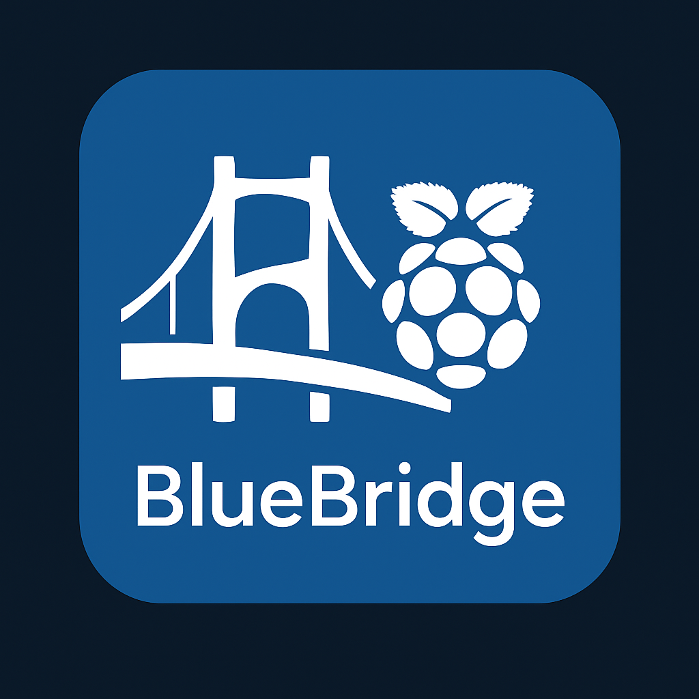
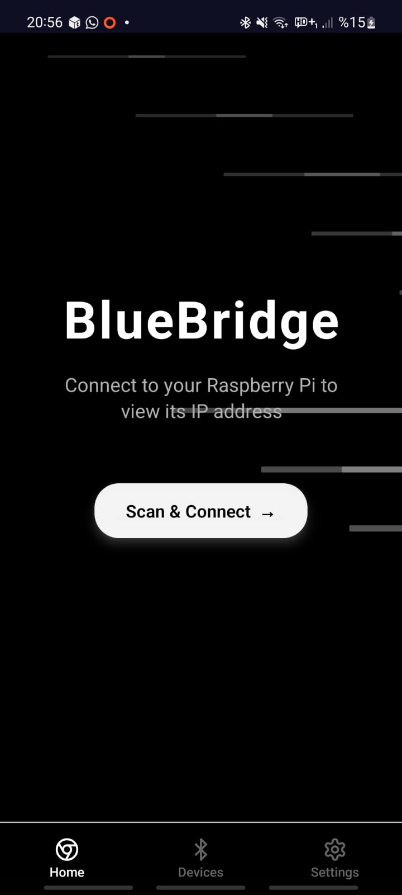
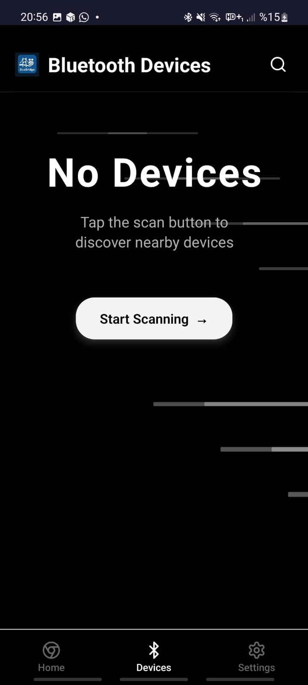
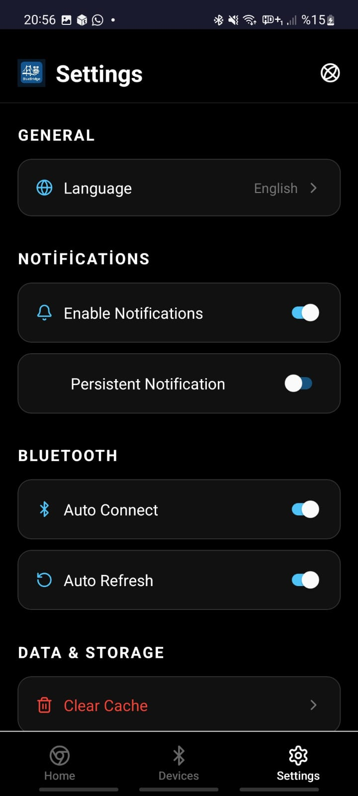
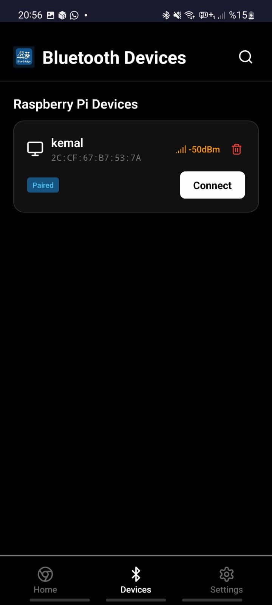
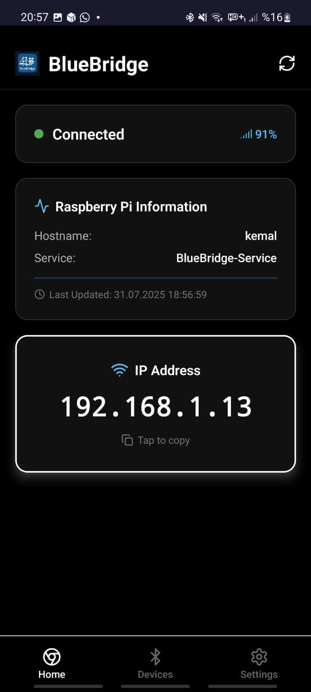

<div align="center">
  
  
  # 🌉 BlueBridge
  ### Raspberry Pi Bluetooth Connector
  
  
  
  
  
  
  <br><br>
  
</div>

## 📱 Proje Hakkında

BlueBridge, Raspberry Pi cihazınızın IP adresini Bluetooth üzerinden Android telefonunuza aktaran modern bir mobil uygulamadır. Üniversite öğrencileri ve geliştiriciler için tasarlanmış bu uygulama, Raspberry Pi'nize SSH veya VNC bağlantısı kurmak için gerekli IP adresini kolayca almanızı sağlar.

### ✨ Özellikler

<div align="center">
  <table>
    <tr>
      <td align="center" width="33%">
        <h4>🔗 Bağlantı</h4>
        <p><strong>Bluetooth Bağlantısı</strong><br>
        Raspberry Pi ile güvenli<br>
        Bluetooth bağlantısı</p>
      </td>
      <td align="center" width="33%">
        <h4>📍 IP Görüntüleme</h4>
        <p><strong>Anlık IP Adresi</strong><br>
        Pi'nizin güncel IP adresini<br>
        anlık olarak görün</p>
      </td>
      <td align="center" width="33%">
        <h4>📋 Kolay Kopyalama</h4>
        <p><strong>Tek Dokunuş</strong><br>
        IP adresini panoya<br>
        tek dokunuşla kopyalayın</p>
      </td>
    </tr>
    <tr>
      <td align="center">
        <h4>🌍 Çok Dilli</h4>
        <p><strong>TR/EN Destek</strong><br>
        Türkçe ve İngilizce<br>
        dil desteği</p>
      </td>
      <td align="center">
        <h4>🎨 Modern Tasarım</h4>
        <p><strong>Animasyonlu UI</strong><br>
        Kullanıcı dostu<br>
        modern arayüz</p>
      </td>
      <td align="center">
        <h4>⚙️ Gelişmiş Ayarlar</h4>
        <p><strong>Özelleştirme</strong><br>
        Otomatik bağlantı ve<br>
        bildirim ayarları</p>
      </td>
    </tr>
  </table>
</div>

## 🚀 Kurulum

<div align="center">
  <table>
    <tr>
      <td width="50%" align="center">
        <h3>📱 Android Uygulaması</h3>
        
        <br><br>
        <ol align="left">
          <li><code>BlueBridge.apk</code> dosyasını indirin</li>
          <li>Bilinmeyen kaynaklardan kuruluma izin verin</li>
          <li>APK dosyasını çalıştırarak kurun</li>
          <li>Bluetooth ve konum izinlerini verin</li>
        </ol>
      </td>
      <td width="50%" align="center">
        <h3>🥧 Raspberry Pi Kurulumu</h3>
        
        <br><br>
        <ol align="left">
          <li>Dosyaları Pi'nize kopyalayın</li>
          <li>Kurulum scriptini çalıştırın:</li>
        </ol>
        <pre align="left">chmod +x pi-setup.bash
sudo ./pi-setup.bash</pre>
      </td>
    </tr>
  </table>
</div>

### 🔧 Kurulum Scripti Özellikleri

<div align="center">
  <table>
    <tr>
      <td>✅ Python paketlerini yükler</td>
      <td>✅ Bluetooth servisini yapılandırır</td>
    </tr>
    <tr>
      <td>✅ Sistem servisi olarak kurar</td>
      <td>✅ Otomatik başlatma ayarları</td>
    </tr>
    <tr>
      <td>✅ Log dosyası oluşturur</td>
      <td>✅ Kaldırma scripti hazırlar</td>
    </tr>
  </table>
</div>

## 📖 Kullanım

### 1. Raspberry Pi'yi Hazırlayın
- Pi'nizde kurulum scriptini çalıştırın
- Bluetooth'un açık olduğundan emin olun
- BlueBridge servisi otomatik olarak başlayacak

### 2. Android Uygulamasını Kullanın
- BlueBridge uygulamasını açın
- "Scan & Connect" butonuna basın
- Raspberry Pi'nizi listeden seçin
- Bağlantı kurulduktan sonra IP adresini görün

### 3. IP Adresini Kullanın
- Görüntülenen IP adresine dokunarak kopyalayın
- SSH: `ssh pi@[IP_ADRESI]`
- VNC: VNC Viewer'da IP adresini girin

## 🛠️ Teknik Detaylar

### Android Uygulaması
- **Framework**: React Native + Expo
- **Bluetooth**: React Native Bluetooth Classic
- **Animasyonlar**: React Native Reanimated
- **Navigasyon**: Expo Router
- **Dil Desteği**: i18n

### Raspberry Pi Sunucusu
- **Dil**: Python 3
- **Bluetooth**: PyBluez
- **Servis**: systemd
- **Protokol**: RFCOMM

## 📋 Gereksinimler

### Android
- Android 6.0+ (API Level 23+)
- Bluetooth desteği
- Konum izni (Bluetooth tarama için)

### Raspberry Pi
- Raspberry Pi 3/4/Zero W (Bluetooth desteği olan)
- Raspberry Pi OS (Bullseye veya üzeri)
- Python 3.7+
- Bluetooth etkin

## 🔧 Sorun Giderme

### Bağlantı Sorunları
- Raspberry Pi'de Bluetooth servisinin çalıştığından emin olun
- Android'de Bluetooth ve konum izinlerini kontrol edin
- Cihazlar arası mesafeyi azaltın

### IP Adresi Görünmüyor
- Raspberry Pi'nin WiFi/Ethernet bağlantısını kontrol edin
- BlueBridge servisinin çalıştığından emin olun: `sudo systemctl status bluebridge`

### Servis Sorunları
```bash
# Servisi yeniden başlatın
sudo systemctl restart bluebridge

# Log'ları kontrol edin
sudo journalctl -u bluebridge -f
```

## 🤝 Katkıda Bulunma

1. Bu repository'yi fork edin
2. Feature branch oluşturun (`git checkout -b feature/amazing-feature`)
3. Değişikliklerinizi commit edin (`git commit -m 'Add amazing feature'`)
4. Branch'inizi push edin (`git push origin feature/amazing-feature`)
5. Pull Request oluşturun

## 📄 Lisans

Bu proje MIT lisansı altında lisanslanmıştır. Detaylar için `LICENSE` dosyasına bakın.

## 👨‍💻 Geliştirici

**Mustafa Kemal Çıngıl**
- GitHub: [@MustafaKemal0146](https://github.com/MustafaKemal0146)
- Email: mustafakemal0146@gmail.com

---

<div align="center">
  <p>Made with ❤️ by Mustafa Kemal Çıngıl</p>
  <p>🌟 Bu projeyi beğendiyseniz yıldız vermeyi unutmayın!</p>
</div>

## 📸 Uygulama Ekran Görüntüleri

<div align="center">
  <table>
    <tr>
      <td align="center" width="20%">
        <br>
        <strong>🏠 Ana Sayfa</strong><br>
        <small>Animasyonlu arkaplan ve bağlantı durumu</small>
      </td>
      <td align="center" width="20%">
        <br>
        <strong>📱 Cihazlar</strong><br>
        <small>Bluetooth cihaz tarama ve listesi</small>
      </td>
      <td align="center" width="20%">
        <br>
        <strong>⚙️ Ayarlar</strong><br>
        <small>Dil seçimi ve uygulama ayarları</small>
      </td>
      <td align="center" width="20%">
        <br>
        <strong>🔍 Cihaz Bulundu</strong><br>
        <small>Raspberry Pi tespit edildi</small>
      </td>
      <td align="center" width="20%">
        <br>
        <strong>✅ Bağlantı Kuruldu</strong><br>
        <small>IP adresi görüntüleme ve kopyalama</small>
      </td>
    </tr>
  </table>
</div>

### 🎯 Uygulama Akışı
1. **Ana Sayfa** → Animasyonlu karşılama ve bağlantı durumu
2. **Cihaz Tarama** → Bluetooth ile Raspberry Pi arama
3. **Cihaz Seçimi** → Bulunan Pi'yi seçme ve bağlanma
4. **IP Görüntüleme** → Pi'nin IP adresini görme ve kopyalama
5. **Ayarlar** → Dil ve uygulama tercihlerini ayarlama

## 🔄 Güncellemeler

### v1.3.0
- Modern animasyonlu tasarım
- Geliştirilmiş Bluetooth bağlantısı
- Çok dilli destek
- Otomatik servis kurulumu

### v1.2.0
- İlk kararlı sürüm
- Temel Bluetooth fonksiyonları
- IP adresi görüntüleme

## 🎯 Gelecek Planları

- [ ] iOS uygulaması
- [ ] Web arayüzü
- [ ] Çoklu Pi desteği
- [ ] SSH terminal entegrasyonu
- [ ] VNC viewer entegrasyonu
- [ ] Dosya transferi
- [ ] Sistem monitoring

## ⚠️ Önemli Notlar

- Bu uygulama eğitim amaçlı geliştirilmiştir
- Güvenlik için güçlü şifreler kullanın
- Bluetooth bağlantısı kısa mesafeli çalışır
- Pi'nizin güvenlik güncellemelerini takip edin

## 🆘 Destek

Sorunlarınız için:
1. GitHub Issues bölümünü kullanın
2. Detaylı hata açıklaması yapın
3. Sistem bilgilerinizi paylaşın
4. Log dosyalarını ekleyin

## 📁 Dosya Yapısı

```
share/
├── 📱 BlueBridge.apk          # Android uygulaması (APK dosyası)
├── 📄 README.md               # Bu dosya
├── 🐍 bluebridge-server.py    # Raspberry Pi sunucu scripti
├── 🔧 pi-setup.bash           # Otomatik kurulum scripti
└── img/
    └── 🖼️ favicon.png          # BlueBridge logosu
```

### 📦 İndirme ve Kurulum Sırası

1. **Tüm dosyaları indirin** (ZIP olarak veya git clone)
2. **Raspberry Pi'de kurulum yapın**: `sudo ./pi-setup.bash`
3. **Android'e APK kurun**: `BlueBridge.apk`
4. **Uygulamayı açın ve bağlanın** 🎉

---

<div align="center">
  
  <br>
  <strong>BlueBridge</strong> - Raspberry Pi'nizi telefonunuzla buluşturan köprü! 🌉📱
  <br><br>
  <a href="https://github.com/MustafaKemal0146/BlueBridge">⭐ GitHub'da Yıldız Verin</a>
</div>