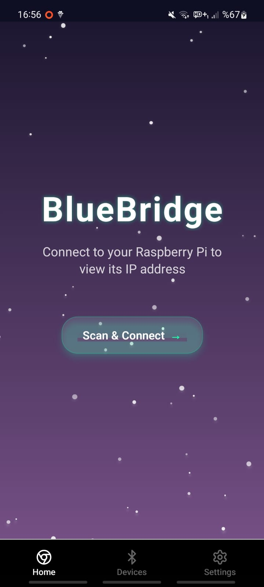
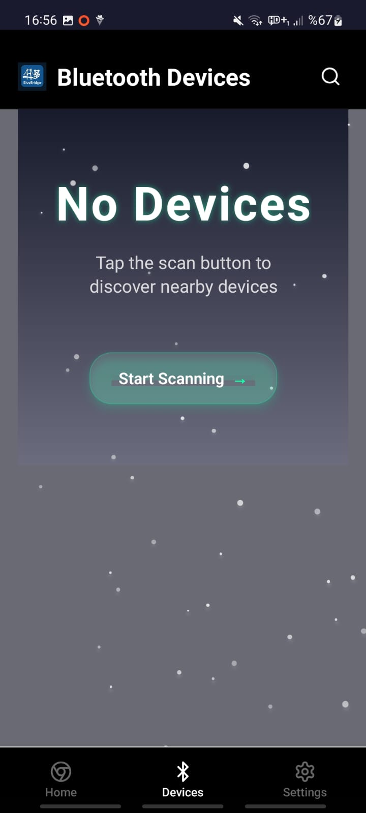

<div align="center">
  
  # 🌉 BlueBridge
  ### Raspberry Pi Bluetooth Connector
  
  
  
  
  
  
  <br><br>
  
</div>

## 📱 Proje Hakkında

BlueBridge, Raspberry Pi cihazınızın IP adresini Bluetooth üzerinden Android telefonunuza aktaran modern bir mobil uygulamadır. Üniversite öğrencileri ve geliştiriciler için tasarlanmış bu uygulama, Raspberry Pi'nize SSH veya VNC bağlantısı kurmak için gerekli IP adresini kolayca almanızı sağlar.

### ✨ Özellikler

<div align="center">
  <table>
    <tr>
      <td align="center" width="33%">
        <h4>🔗 Bağlantı</h4>
        <p><strong>Bluetooth Bağlantısı</strong><br>
        Raspberry Pi ile güvenli<br>
        Bluetooth bağlantısı</p>
      </td>
      <td align="center" width="33%">
        <h4>📍 IP Görüntüleme</h4>
        <p><strong>Anlık IP Adresi</strong><br>
        Pi'nizin güncel IP adresini<br>
        anlık olarak görün</p>
      </td>
      <td align="center" width="33%">
        <h4>🖥️ SSH Bağlantısı</h4>
        <p><strong>Terminal Erişimi</strong><br>
        SSH komutu ile doğrudan<br>
        terminal bağlantısı</p>
      </td>
    </tr>
    <tr>
      <td align="center">
        <h4>🌍 Çok Dilli</h4>
        <p><strong>TR/EN Destek</strong><br>
        Türkçe ve İngilizce<br>
        dil desteği</p>
      </td>
      <td align="center">
        <h4>🎨 Aurora Tasarım</h4>
        <p><strong>Modern Animasyonlar</strong><br>
        Renkli aurora efektli<br>
        modern arayüz</p>
      </td>
      <td align="center">
        <h4>📋 Kolay Kopyalama</h4>
        <p><strong>Tek Dokunuş</strong><br>
        IP ve SSH komutunu<br>
        tek dokunuşla kopyalayın</p>
      </td>
    </tr>
  </table>
</div>

## 🚀 Kurulum

<div align="center">
  <table>
    <tr>
      <td width="50%" align="center">
        <h3>📱 Android Uygulaması</h3>
        
        <br><br>
        <div align="center">
          <a href="BlueBridgeV1.4.apk" download>
            
          </a>
          <br><br>
          <a href="V1.3/BlueBridgeV1.3.apk" download>
            
          </a>
        </div>
        <br>
        <ol align="left">
          <li><strong>v1.4.0 (Güncel):</strong> <code>BlueBridgeV1.4.apk</code> dosyasını indirin</li>
          <li><strong>v1.3.0 (Arşiv):</strong> <code>V1.3/BlueBridgeV1.3.apk</code> dosyası</li>
          <li>Bilinmeyen kaynaklardan kuruluma izin verin</li>
          <li>APK dosyasını çalıştırarak kurun</li>
          <li>Bluetooth ve konum izinlerini verin</li>
        </ol>
      </td>
      <td width="50%" align="center">
        <h3>🥧 Raspberry Pi Kurulumu</h3>
        
        <br><br>
        <ol align="left">
          <li>Dosyaları Pi'nize kopyalayın</li>
          <li>Kurulum scriptini çalıştırın:</li>
        </ol>
        <pre align="left">chmod +x pi-setup.bash
sudo ./pi-setup.bash</pre>
      </td>
    </tr>
  </table>
</div>

### 🔧 Kurulum Scripti Özellikleri

<div align="center">
  <table>
    <tr>
      <td>✅ Python paketlerini yükler</td>
      <td>✅ Bluetooth servisini yapılandırır</td>
    </tr>
    <tr>
      <td>✅ Sistem servisi olarak kurar</td>
      <td>✅ Otomatik başlatma ayarları</td>
    </tr>
    <tr>
      <td>✅ Log dosyası oluşturur</td>
      <td>✅ Kaldırma scripti hazırlar</td>
    </tr>
  </table>
</div>

## 📖 Kullanım

### 1. Raspberry Pi'yi Hazırlayın
- Pi'nizde kurulum scriptini çalıştırın
- Bluetooth'un açık olduğundan emin olun
- Raspberry cihazınız ve android cihazınızı bluetooth ile bağlayın
- BlueBridge servisi otomatik olarak başlayacak

### 2. Android Uygulamasını Kullanın
- BlueBridge uygulamasını açın
- "Scan & Connect" butonuna basın (Tekrardan söylüyorum pi ile android'i önceden bluetooth ile bağlayın!)
- Raspberry Pi'nizi listeden seçin
- Bağlantı kurulduktan sonra IP adresini görün

### 3. IP Adresini ve SSH'ı Kullanın
- Görüntülenen IP adresine dokunarak kopyalayın
- "SSH ile Bağlan" butonuna basarak terminal bağlantısı kurun
- SSH komutunu kopyalayıp terminal'de kullanın
- Sistem bilgilerini (CPU, RAM, Disk, Sıcaklık) gerçek zamanlı izleyin
- VNC: VNC Viewer'da IP adresini girin

## 🛠️ Teknik Detaylar

### Android Uygulaması
- **Framework**: React Native + Expo
- **Bluetooth**: React Native Bluetooth Classic
- **Animasyonlar**: React Native Reanimated
- **Navigasyon**: Expo Router
- **Dil Desteği**: i18n

### Raspberry Pi Sunucusu
- **Dil**: Python 3
- **Bluetooth**: PyBluez
- **Servis**: systemd
- **Protokol**: RFCOMM

## 📋 Gereksinimler

### Android
- Android 6.0+ (API Level 23+)
- Bluetooth desteği
- Konum izni (Bluetooth tarama için)

### Raspberry Pi
- Raspberry Pi 3/4/5/Zero W (Bluetooth desteği olan)
- Raspberry Pi OS (Bullseye veya üzeri)
- Python 3.7+
- Bluetooth etkin

## 🔧 Sorun Giderme

### Bağlantı Sorunları
- Raspberry Pi'de Bluetooth servisinin çalıştığından emin olun
- Android'de Bluetooth ve konum izinlerini kontrol edin
- Cihazlar arası mesafeyi azaltın

### IP Adresi Görünmüyor
- Raspberry Pi'nin WiFi/Ethernet bağlantısını kontrol edin
- BlueBridge servisinin çalıştığından emin olun: `sudo systemctl status bluebridge`

### Servis Sorunları
```bash
# Servisi yeniden başlatın
sudo systemctl restart bluebridge

# Log'ları kontrol edin
sudo journalctl -u bluebridge -f
```

## 🤝 Katkıda Bulunma

1. Bu Projeyi Yıldızlayın :)

## 📄 Lisans

Bu proje MIT lisansı altında lisanslanmıştır. Detaylar için `LICENSE` dosyasına bakın.

## 👨‍💻 Geliştirici

**Mustafa Kemal Çıngıl**
- GitHub: [@MustafaKemal0146](https://github.com/MustafaKemal0146)
- Email: ismustafakemal0146@gmail.com
- Linkedin: [@Mustafakemalcingil](https://www.linkedin.com/in/mustafakemalcingil/)

---

<div align="center">
  <p>Made with ❤️ by Mustafa Kemal Çıngıl</p>
  <p>🌟 Bu projeyi beğendiyseniz yıldız vermeyi unutmayın!</p>
</div>

## 📸 Uygulama Ekran Görüntüleri

### 🆕 v1.4.0 Yeni Tasarım

<div align="center">
  <table>
    <tr>
      <td align="center" width="50%">
        <br>
        <strong>🌌 Yeni Ana Sayfa (v1.4.0)</strong><br>
        <small>Aurora animasyonlu arkaplan, SSH butonu ve sistem bilgileri</small>
      </td>
      <td align="center" width="50%">
        <br>
        <strong>📱 Yeni Cihazlar Sayfası (v1.4.0)</strong><br>
        <small>Aurora temalı cihaz tarama ve gelişmiş uyarılar</small>
      </td>
    </tr>
  </table>
</div>

### 📱 Önceki Sürüm Ekranları (v1.3.0)

<div align="center">
  <table>
    <tr>
      <td align="center" width="20%">
        <br>
        <strong>🏠 Ana Sayfa</strong><br>
        <small>Eski tasarım</small>
      </td>
      <td align="center" width="20%">
        <br>
        <strong>📱 Cihazlar</strong><br>
        <small>Eski tasarım</small>
      </td>
      <td align="center" width="20%">
        <br>
        <strong>⚙️ Ayarlar</strong><br>
        <small>Dil seçimi ve ayarlar</small>
      </td>
      <td align="center" width="20%">
        <br>
        <strong>🔍 Cihaz Bulundu</strong><br>
        <small>Pi tespit edildi</small>
      </td>
      <td align="center" width="20%">
        <br>
        <strong>✅ Bağlandı</strong><br>
        <small>IP görüntüleme</small>
      </td>
    </tr>
  </table>
</div>

### 🎯 Uygulama Akışı
1. **Ana Sayfa** → Animasyonlu karşılama ve bağlantı durumu
2. **Cihaz Tarama** → Bluetooth ile Raspberry Pi arama
3. **Cihaz Seçimi** → Bulunan Pi'yi seçme ve bağlanma
4. **IP Görüntüleme** → Pi'nin IP adresini görme ve kopyalama
5. **Ayarlar** → Dil ve uygulama tercihlerini ayarlama

## 🔄 v1.4.0 Güncellemesi Nasıl Kurulur?

### Mevcut Kullanıcılar İçin Güncelleme:

```bash
# SSH ile Pi'ye bağlan
ssh pi@[PI_IP_ADRESI]

# 1. Mevcut servisi durdur
sudo systemctl stop bluebridge

# 2. Yeni server dosyasını güncelle
sudo cat > /opt/bluebridge/raspberry-pi-bluetooth-server.py << 'EOF'
# (Güncellenmiş server kodu - GitHub'dan alın)
EOF

# 3. İzinleri ayarla
sudo chmod +x /opt/bluebridge/raspberry-pi-bluetooth-server.py

# 4. SSH servisini etkinleştir
sudo systemctl enable ssh
sudo systemctl start ssh

# 5. Servisi yeniden başlat
sudo systemctl start bluebridge

# 6. Durumu kontrol et
sudo systemctl status bluebridge
```

### Yeni Kurulum İçin:
Kurulum scriptini çalıştırın: `sudo ./pi-setup.bash`

## 🔄 Güncellemeler

### v1.4.0 - Sistem Monitörü ve SSH Entegrasyonu
- 🖥️ **Gerçek Zamanlı Sistem Bilgileri** - CPU, RAM, Disk, Sıcaklık
- 🔗 **SSH Terminal Bağlantısı** - Tek tıkla SSH komut kopyalama
- 🌌 **Aurora Arka Plan Animasyonu** - Renkli yıldızlı gökyüzü efekti
- ⚠️ **Gelişmiş Kullanıcı Uyarıları** - Bluetooth eşleştirme ve WiFi uyarıları
- 📊 **Performans Metrikleri** - Gerçek Pi verilerinden sistem durumu
- 🎨 **Modern UI Güncellemeleri** - Daha şık kartlar ve animasyonlar

### v1.3.0
- Modern animasyonlu tasarım
- Geliştirilmiş Bluetooth bağlantısı
- Çok dilli destek
- Otomatik servis kurulumu

### v1.2.0
- İlk kararlı sürüm
- Temel Bluetooth fonksiyonları
- IP adresi görüntüleme

## 🎯 Gelecek Planları

- [ ] iOS uygulaması
- [ ] Çoklu Pi desteği
- [x] SSH terminal entegrasyonu ✅ v1.4.0
- [ ] VNC viewer entegrasyonu
- [ ] Dosya transferi
- [x] Sistem monitoring ✅ v1.4.0
- [ ] Terminal emülatörü (uygulama içi)
- [ ] Grafik performans gösterimi

## ⚠️ Önemli Notlar

- Bu uygulama eğitim amaçlı geliştirilmiştir
- Güvenlik için güçlü şifreler kullanın
- Bluetooth bağlantısı kısa mesafeli çalışır
- Pi'nizin güvenlik güncellemelerini takip edin

## 🆘 Destek

Sorunlarınız için:
1. GitHub Issues bölümünü kullanın
2. Detaylı hata açıklaması yapın
3. Sistem bilgilerinizi paylaşın
4. Log dosyalarını ekleyin

## 📁 Dosya Yapısı

```
BlueBridge/
├── 📱 BlueBridgeV1.4.apk      # Android uygulaması v1.4.0 (Güncel)
├── 📄 README.md               # Bu dosya
├── 🐍 bluebridge-server.py    # Raspberry Pi sunucu scripti v1.4.0
├── 🔧 pi-setup.bash           # Otomatik kurulum scripti v1.4.0
├── img/
│   ├── 🖼️ yenianasayfa.jpg     # v1.4.0 Ana sayfa ekran görüntüsü
│   ├── 🖼️ yenidevices.jpg      # v1.4.0 Cihazlar sayfası ekran görüntüsü
│   └── 🖼️ favicon.png          # BlueBridge logosu
└── V1.3/                      # ESKİ SÜRÜM ARŞİVİ
    ├── 📱 BlueBridgeV1.3.apk   # Android uygulaması v1.3.0
    ├── 📄 README.md            # v1.3.0 dokümantasyonu
    ├── 🐍 bluebridge-server.py # v1.3.0 sunucu scripti
    └── 🔧 pi-setup.bash        # v1.3.0 kurulum scripti
```

### 📦 İndirme ve Kurulum Sırası

1. **BlueBridge klasörünü indirin** (ZIP olarak veya git clone)
2. **Raspberry Pi'de kurulum yapın**: `sudo ./pi-setup.bash`
3. **Android'e APK kurun**: `BlueBridgeV1.4.apk` (v1.4.0 - Güncel)
4. **Pi'ye bağlanın ve sistem bilgilerini izleyin** 🎉

### 📂 Eski Sürümler
- **v1.3.0 dosyaları**: `V1.3/` klasöründe arşivlenmiştir
- **Eski sürüm APK**: `V1.3/BlueBridgeV1.3.apk`

### 🆕 v1.4.0 Yenilikleri:
- **Gerçek Zamanlı Monitoring**: CPU %25, RAM %45, Disk %18, Sıcaklık 52°C
- **SSH Entegrasyonu**: `ssh kemal@192.168.1.100` komutunu tek tıkla kopyala
- **Aurora Animasyon**: Renkli yıldızlı gökyüzü arka planı
- **Akıllı Uyarılar**: Bluetooth eşleştirme ve WiFi bağlantı rehberi

---

<div align="center">
  
  <br>
  <strong>BlueBridge</strong> - Raspberry Pi'nizi telefonunuzla buluşturan köprü! 🌉📱
  <br><br>
  <a href="https://github.com/MustafaKemal0146/BlueBridge">⭐ GitHub'da Yıldız Verin</a>
</div>